# 前言

近期学习DEX文件结构为学习APP加壳脱壳打基础,自实现了一个简易的DEX解析器加深理解

DEX文件结构整体看不复杂,深究时发现DexCLassDef结构非常复杂,编码的数据结构,嵌套和指向关系

本文作为近期学习的一个阶段总结以及知识分享,后期再完善Todo部分

**由于本人水平有限,文章错漏之处还望大佬批评指正**


环境&工具:

* 010editor 15.0.1 (13.0.1有bug,打开大文件分析时容易崩溃)

* Clion 2024.2.3
* JDK 11.0.23
* MinGW 14.2.0
* Android Studio

# 准备

自行编译dex文件供后续分析

```java
public class HelloDEX{
	public static void main(String[] args){
		System.out.println("Hello Dex!");
	}
}
```

```cmd
javac HelloDEX.java
d8 HelloDEX.class
```

可能遇到报错如下,这是因为d8需要java11+的环境,不支持java8

```
Error: A JNI error has occurred, please check your installation and try again
Exception in thread "main" java.lang.UnsupportedClassVersionError: com/android/tools/r8/D8 has been compiled by a more recent version of the Java Runtime (class file version 55.0), this version of the Java Runtime only recognizes class file versions up to 52.0
```


# 数据类型

Android源码 http://androidxref.com/2.3.7/xref/dalvik/libdex/DexFile.h 定义了dex文件用到的数据结构

| 自定义类型 | 原类型   | 含义                    |
| :--------- | :------- | :---------------------- |
| s1         | int8_t   | 有符号单字节            |
| u1         | uint8_t  | 无符号单字节            |
| s2         | int16_t  |                         |
| u2         | uint16_t |                         |
| s4         | int32_t  |                         |
| u4         | uint32_t |                         |
| s8         | int64_t  |                         |
| u8         | uint64_t |                         |
| sleb128    | 无       | 有符号LEB128,可变长度   |
| uleb128    | 无       | 无符号LEB128,可变长度   |
| uleb128p1  | 无       | 等于ULEB128加1,可变长度 |

## Leb128

sleb128、uleb128、uleb128p1是Dex文件中特有的LEB128类型.在下述Android源码位置可以找到LEB128的实现.http://androidxref.com/2.3.7/xref/dalvik/libdex/Leb128.h

每个LEB128由1-5字节组成,所有字节组合在一起表示一个32位的数据, 每个字节只有低7位为有效位,最高位标识是否需要使用额外字节

如果第1个字节的最高位为1,表示LEB128需要使用第2个字节,如果第2个字节的最高位为1,表示会使用第3个字节,依次类推,直到最后一个字节的最高位为0

uleb128读取代码如下

值得注意的是参数为二级指针,也就是说,调用该函数时会移动一级指针,一级指针的偏移量即为读取到的uleb128的大小

```cpp
int readUnsignedLeb128(const u1** pStream) {
    const u1* ptr = *pStream;
    int result = *(ptr++);

    if (result > 0x7f) {
        int cur = *(ptr++);
        result = (result & 0x7f) | ((cur & 0x7f) << 7);
        if (cur > 0x7f) {
            cur = *(ptr++);
            result |= (cur & 0x7f) << 14;
            if (cur > 0x7f) {
                cur = *(ptr++);
                result |= (cur & 0x7f) << 21;
                if (cur > 0x7f) {
                    /*
                     * Note: We don't check to see if cur is out of
                     * range here, meaning we tolerate garbage in the
                     * high four-order bits.
                     */
                    cur = *(ptr++);
                    result |= cur << 28;
                }
            }
        }
    }

    *pStream = ptr;
    return result;
}
```

为方便使用自定义了myReadUnsignedLeb128函数,参数为一级指针,返回读取的数据及其大小

```cpp
// 传入指针直接读取数据并返回数据和读取的大小(可选)
int myReadUnsignedLeb128(const u1* pData,size_t* readSize) {
    const u1** pStream = &pData;
    u4 result=readUnsignedLeb128(pStream);
    if(readSize)
        *readSize=unsignedLeb128Size(result);
    return result;
}
```


## encoded_value

参考Android官方文档https://source.android.com/docs/core/dalvik/dex-format?hl=zh-cn#encoding

解析代码参考以下文档,只找到了java代码

http://androidxref.com/2.3.7/xref/cts/tools/dex-tools/src/dex/reader/DexEncodedValueImpl.java

http://androidxref.com/2.3.7/xref/dalvik/dx/src/com/android/dx/dex/file/ValueEncoder.java

解析DexClassDef结构时,Annotation的annotation_element和encoded_array_item会使用该编码

编码格式如下,1字节的头用于指定value格式和大小,后续紧跟数据,需要根据类型解析

| 名称                           | 格式    | 说明                                                         |
| :----------------------------- | :------ | :----------------------------------------------------------- |
| (value_arg << 5) \| value_type | ubyte   | 高3位为value_arg的值，低5位为value_type的值，value_type指定value的格式。 |
| value                          | ubyte[] | 用于表示值的字节，不同 value_type 字节的长度不同且采用不同的解译方式；不过一律采用小端字节序。 |

value_type枚举定义如下

| 类型名称            | value_type | value_arg          | value格式          | 说明                                                         |
| :------------------ | :--------- | :----------------- | :----------------- | :----------------------------------------------------------- |
| VALUE_BYTE          | 0x00       | （无；必须为 `0`） | ubyte[1]           | 有符号的单字节整数值                                         |
| VALUE_SHORT         | 0x02       | size - 1 (0…1)     | ubyte[size]        | 有符号的双字节整数值，符号扩展                               |
| VALUE_CHAR          | 0x03       | size - 1 (0…1)     | ubyte[size]        | 无符号的双字节整数值，零扩展                                 |
| VALUE_INT           | 0x04       | size - 1 (0…3)     | ubyte[size]        | 有符号的四字节整数值，符号扩展                               |
| VALUE_LONG          | 0x06       | size - 1 (0…7)     | ubyte[size]        | 有符号的八字节整数值，符号扩展                               |
| VALUE_FLOAT         | 0x10       | size - 1 (0…3)     | ubyte[size]        | 四字节位模式，向右零扩展，系统会将其解译为 IEEE754 32 位浮点值 |
| VALUE_DOUBLE        | 0x11       | size - 1 (0…7)     | ubyte[size]        | 八字节位模式，向右零扩展，系统会将其解译为 IEEE754 64 位浮点值 |
| VALUE_METHOD_TYPE   | 0x15       | size - 1 (0…3)     | ubyte[size]        | 无符号（零扩展）四字节整数值，会被解译为要编入 `proto_ids` 区段的索引；表示方法类型值 |
| VALUE_METHOD_HANDLE | 0x16       | size - 1 (0…3)     | ubyte[size]        | 无符号（零扩展）四字节整数值，会被解译为要编入 `method_handles` 区段的索引；表示方法句柄值 |
| VALUE_STRING        | 0x17       | size - 1 (0…3)     | ubyte[size]        | 无符号（零扩展）四字节整数值，会被解译为要编入 `string_ids` 区段的索引；表示字符串值 |
| VALUE_TYPE          | 0x18       | size - 1 (0…3)     | ubyte[size]        | 无符号（零扩展）四字节整数值，会被解译为要编入 `type_ids` 区段的索引；表示反射类型/类值 |
| VALUE_FIELD         | 0x19       | size - 1 (0…3)     | ubyte[size]        | 无符号（零扩展）四字节整数值，会被解译为要编入 `field_ids` 区段的索引；表示反射字段值 |
| VALUE_METHOD        | 0x1a       | size - 1 (0…3)     | ubyte[size]        | 无符号（零扩展）四字节整数值，会被解译为要编入 `method_ids` 区段的索引；表示反射方法值 |
| VALUE_ENUM          | 0x1b       | size - 1 (0…3)     | ubyte[size]        | 无符号（零扩展）四字节整数值，会被解译为要编入 `field_ids` 区段的索引；表示枚举类型常量的值 |
| VALUE_ARRAY         | 0x1c       | （无；必须为 `0`） | encoded_array      | 值的数组，采用下文“`encoded_array` 格式”所指定的格式。`value` 的大小隐含在编码中。 |
| VALUE_ANNOTATION    | 0x1d       | （无；必须为 `0`） | encoded_annotation | 子注解，采用下文“`encoded_annotation` 格式”所指定的格式。`value` 的大小隐含在编码中。 |
| VALUE_NULL          | 0x1e       | （无；必须为 `0`） | （无）             | `null` 引用值                                                |
| VALUE_BOOLEAN       | 0x1f       | 布尔值 (0…1)       | （无）             | 一位值；`0` 表示 `false`，`1` 表示 `true`。该位在 `value_arg` 中表示。 |

解析代码如下(**该函数在解析DexClassDef的Annotation时才会使用,可先忽略**)

parseEncodedValue函数会自动读取单个encoded_value并返回解析后的字符串(类型:值 的键值对形式)以及value占用的真实字节数

```cpp
// 读取EncodedValue, 由于大小不固定, 故直接以数组赋值形式取值
void DexFile::getEncodedValue(ubyte* pDest,const ubyte* pValue,int size) {
    for(int i=0;i<size;i++) {
        pDest[i]=pValue[i];
    }
}
// 解析EncodedValue, 返回解析后的字符串以及value真实大小 Todo: 完善解析逻辑,剩余3个分支
std::string DexFile::parseEncodedValue(ubyte* pEncodedValue,size_t& valueRealSize) {
    ubyte valueArg = GetValueArg(pEncodedValue[0]);// arg=size-1,值占用的字节数<=对应类型大小,不含头部的单字节
    ubyte valueType = GetValueType(pEncodedValue[0]);
    // 假如int=0时,占2字节,头1字节,值0占1字节,所以要同时判断arg和type
    if(valueArg==0) {
        //arg==0时,要确定是arg固定为0的特殊类型还是其他类型
        //特殊类型只有1字节头,其他类型是1字节头+1字节数据
        bool isSpecialType=false;
        switch (valueType) {
            case VALUE_BYTE:
            case VALUE_ARRAY:
            case VALUE_ANNOTATION:
            case VALUE_NULL:
            case VALUE_BOOLEAN:
            isSpecialType=true;
            break;
        }
        if(isSpecialType)
            valueRealSize=1;
        else
            valueRealSize=2;
    }
    else
        valueRealSize=valueArg+2;// 头部1字节+实际大小 size=head+arg+1
    int readValueSize=valueArg+1;// 需要读取的字节数
    ubyte* pValue=&pEncodedValue[1];
    std::string result;
    unsigned int index=0;
    switch(valueType) {
        // 有符号单字节
        case VALUE_BYTE: {
            char byte=0;
            getEncodedValue((ubyte*)&byte,pValue,readValueSize);
            result="byte:"+std::format("0x{:x}",byte);
            break;
        }
        // 有符号双字节
        case VALUE_SHORT: {
            short value_short=0;
            getEncodedValue((ubyte*)&value_short,pValue,readValueSize);
            result="short:"+std::format("0x{:x}",value_short);
            break;
        }
        // 无符号双字节
        case VALUE_CHAR: {
            unsigned short value_char=0;
            getEncodedValue((ubyte*)&value_char,pValue,readValueSize);
            result="char:"+std::format("0x{:x}",value_char);
            break;
        }
        // 有符号4字节
        case VALUE_INT: {
            int value_int=0;
            getEncodedValue((ubyte*)&value_int,pValue,readValueSize);
            result="int:"+std::format("0x{:x}",value_int);
            break;
        }
        // 有符号8字节
        case VALUE_LONG: {
            long long value_long=0;
            getEncodedValue((ubyte*)&value_long,pValue,readValueSize);
            result="long:"+std::format("0x{:x}",value_long);
            break;
        }
        // 4字节浮点
        case VALUE_FLOAT: {
            float value_float=0;
            getEncodedValue((ubyte*)&value_float,pValue,readValueSize);
            result="float:"+std::format("{:f}",value_float);
            break;
        }
        // 8字节浮点
        case VALUE_DOUBLE: {
            double value_double=0;
            getEncodedValue((ubyte*)&value_double,pValue,readValueSize);
            result="double:"+std::format("{:f}",value_double);
            break;
        }
        // 无符号4字节索引 指向对应结构
        case VALUE_METHOD_TYPE: {
            // ProtoId
            getEncodedValue((ubyte*)&index,pValue,readValueSize);
            result="MethodType:"+std::format("0x{:x}",index)+" "+getProtoIdDataByIndex(index);
            break;
        }
        // todo: 这部分没有定义的成员指向,暂时不知如何解析,参考 https://source.android.com/docs/core/runtime/dex-format?hl=zh-cn#method-handle-item
        case VALUE_METHOD_HANDLE: {
            // MethodHandles
            getEncodedValue((ubyte*)&index,pValue,readValueSize);
            result="MethodHandle Index:"+std::format("0x{:x}",index);
            break;
        }
        case VALUE_STRING: {         
            // StringId
            getEncodedValue((ubyte*)&index,pValue,readValueSize);
            result="String:"+getStringIdDataByIndex(index);
            break;
        }
        case VALUE_TYPE: {
            // TypeId
            getEncodedValue((ubyte*)&index,pValue,readValueSize);
            result="Type:"+parseString(getTypeIdDataByIndex(index));
            break;
        }
        case VALUE_FIELD: {
            // FieldId
            getEncodedValue((ubyte*)&index,pValue,readValueSize);
            result="Field:"+parseString(getFieldIdDataByIndex(index));
            break;
        }
        case VALUE_METHOD: {
            // MethodId
            getEncodedValue((ubyte*)&index,pValue,readValueSize);
            result="Method:"+parseString(getMethodIdDataByIndex(index));
            break;
        }
        case VALUE_ENUM: {
            // FieldId
            getEncodedValue((ubyte*)&index,pValue,readValueSize);
            result="Enum:"+parseString(getFieldIdDataByIndex(index));
            break;
        }
        // todo encoded_array和encoded_annotation结构,不太容易解析
        case VALUE_ARRAY: {
            //getEncodedValue((ubyte*)&index,pValue,readValueSize);
            // DexEncodedArray encodedArray;//直接解析貌似不正确
            // getEncodedValue((ubyte*)&encodedArray,pValue,readValueSize);
            // printClassDefStaticValues(encodedArray);
            // int sizeLen=0;
            // u4 size=myReadUnsignedLeb128(pValue,&sizeLen);
            // u1* pValues=pValue+sizeLen;
            // printf("EncodedArray contains %d values\n",size);
            // unsigned int offset=0;// offset保存前方已访问的结构大小
            // for(int i=0;i<size;i++) {
            //     printf("%s\n",parseEncodedValue(pValues+offset,offset).c_str());
            // }
            //system("pause");
            break;
        }
        case VALUE_ANNOTATION:
        result="Todo......";
        break;
        case VALUE_NULL:
            result="null";
        break;
        // boolean的值存在value_arg中
        case VALUE_BOOLEAN:
            result="bool:";
            if(valueArg)
                result+="true";
            else
                result+="false";
            break;
        default:
            result="Unknown value type";
    }
    return result;
}
```


## encoded_array

| 名称   | 格式                | 说明                                                         |
| :----- | :------------------ | :----------------------------------------------------------- |
| size   | uleb128             | 数组中的元素数量                                             |
| values | encoded_value[size] | 采用本部分所指定格式的一系列 `size` `encoded_value` 字节序列；依序串联。 |

由于encoded_array.values数组元素为encoded_value,所以每个元素的大小不固定,不能当作一般的数组解析


## encoded_annotation

该类型主要在DexClassDef的Annotations部分使用,此处仅做介绍

| 名称     | 格式                     | 说明                                                         |
| :------- | :----------------------- | :----------------------------------------------------------- |
| type_idx | uleb128                  | 注释的类型。这种类型必须是“类”（而非“数组”或“基元”）。       |
| size     | uleb128                  | 此注解中 name-value 映射的数量                               |
| elements | annotation_element[size] | 注解的元素，直接以内嵌形式（不作为偏移量）表示。元素必须按 `string_id` 索引以升序进行排序。 |


## annotation_element

| 名称     | 格式          | 说明                                                         |
| :------- | :------------ | :----------------------------------------------------------- |
| name_idx | uleb128       | 元素名称，表示为要编入 `string_ids` 区段的索引。该字符串必须符合上文定义的 MemberName 的语法。 |
| value    | encoded_value | 元素值                                                       |


# Dex整体结构

dex文件整体结构分为: dex文件头, 索引结构区, data数据区, 示意图如下:

1. dex文件头

   保存了dex文件的基本信息, 例如文件大小,dex头大小,大小端序,索引表的起始地址和大小等

2. 索引结构区

   这部分保存了字符串表,类型表,方法原型表,域表,方法表等结构

   根据这些表和索引可以访问到对应数据

3. data数据区

   所有的代码和数据存放在该区域

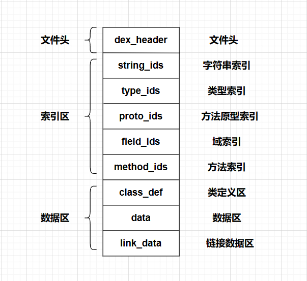

dex文件结构体的定义在Android源码目录/dalvik/libdex/DexFile.h中可以找到，其中定义的dex文件结构体如下：

```cpp
struct DexFile {
    /* directly-mapped "opt" header */
    const DexOptHeader* pOptHeader;

    /* pointers to directly-mapped structs and arrays in base DEX */
    const DexHeader*    pHeader;
    const DexStringId*  pStringIds;
    const DexTypeId*    pTypeIds;
    const DexFieldId*   pFieldIds;
    const DexMethodId*  pMethodIds;
    const DexProtoId*   pProtoIds;
    const DexClassDef*  pClassDefs;
    const DexLink*      pLinkData;

    /*
     * These are mapped out of the "auxillary" section, and may not be
     * included in the file.
     */
    const DexClassLookup* pClassLookup;
    const void*         pRegisterMapPool;       // RegisterMapClassPool

    /* points to start of DEX file data */
    const u1*           baseAddr;

    /* track memory overhead for auxillary structures */
    int                 overhead;

    /* additional app-specific data structures associated with the DEX */
    //void*               auxData;
};

```

为方便使用仅保留部分字段,编写相关函数如下

通过字节buffer或文件路径创建DexFile类并初始化各个字段

```cpp
class DexFile {
    u1*           baseAddr{nullptr};
    DexHeader*    pHeader{nullptr};
    DexStringId*  pStringIds{nullptr};
    DexTypeId*    pTypeIds{nullptr};
    DexFieldId*   pFieldIds{nullptr};
    DexMethodId*  pMethodIds{nullptr};
    DexProtoId*   pProtoIds{nullptr};
    DexClassDef*  pClassDefs{nullptr};
    void initFields(unsigned char *buffer);

}
// Init functions
void DexFile::initFields(unsigned char* buffer) {
    if(buffer==nullptr) {
        printf("Null pointer provided!\n");
        exit(0);
    }
    baseAddr=buffer;
    pHeader=(DexHeader*)baseAddr;
    pStringIds=(DexStringId*)(baseAddr+pHeader->stringIdsOff);
    pTypeIds=(DexTypeId*)(baseAddr+pHeader->typeIdsOff);
    pFieldIds=(DexFieldId*)(baseAddr+pHeader->fieldIdsOff);
    pMethodIds=(DexMethodId*)(baseAddr+pHeader->methodIdsOff);
    pProtoIds=(DexProtoId*)(baseAddr+pHeader->protoIdsOff);
    pClassDefs=(DexClassDef*)(baseAddr+pHeader->classDefsOff);
}
DexFile::DexFile(unsigned char *buffer) {
    initFields(buffer);
}
DexFile::DexFile(std::string filePath) {
    size_t fileLength=0;
    initFields(readFileToBytes(filePath, fileLength));
}
DexFile::~DexFile() {
    delete baseAddr;
}
```


# Dex Header

DexHeader定义如下

```cpp
typedef struct DexHeader {
	u1  magic[8];			//Dex版本号 dex.035 .035即为版本号 
	u4  checksum;           //adler32检验,如果修改了Dex文件,需要修正这个值,否则会运行不起来
	u1  signature[kSHA1DigestLen]; //SHA-1值,Android不检测该值,但如果修改了Dex文件,最好修复该值,再修checksum
	u4  fileSize;           //整个dex文件的大小
	u4  headerSize;         //DexHeader结构的大小,固定为0x70
	u4  endianTag;          //字节序标记,若该字段按小端方式读出来为0x12345678,则整个Dex文件就是小端方式.如果按大端方式读出来为0x12345678,那整个Dex文件就是大端方式
	u4  linkSize;			//链接段大小
	u4  linkOff;			//链接段偏移
	u4  mapOff;				//DexMapList文件偏移
	u4  stringIdsSize;		//DexStringId个数
	u4  stringIdsOff;		//DexStringId文件偏移
	u4  typeIdsSize;		//DexTypeId个数
	u4  typeIdsOff;			//DexTypeId文件偏移
	u4  protoIdsSize;		//DexProtoId个数
	u4  protoIdsOff;		//DexProtoId文件偏移
	u4  fieldIdsSize;		//DexFieldId个数
	u4  fieldIdsOff;		//DexFieldId文件偏移
	u4  methodIdsSize;		//DexMethodId个数
	u4  methodIdsOff;		//DexMethodId文件偏移
	u4  classDefsSize;		//DexClassDef个数
	u4  classDefsOff;		//DexClassDef文件偏移
	u4  dataSize;			//数据段大小
	u4  dataOff;			//数据段文件偏移
} DexHeader;
```

打印DexHeader

```cpp
void DexFile::printDexHeader() {
    printf("DexHeader:\n");
    printf("\tmagic: ");printHexBytes(pHeader->magic,sizeof(pHeader->magic));printf("\n");
    printf("\tchecksum: %#x\n",pHeader->checksum);
    printf("\tsignature: ");printHexBytes(pHeader->signature,kSHA1DigestLen);printf("\n");
    printf("\tFileSize: %#x\n",pHeader->fileSize);
    printf("\tHeaderSize: %#x\n",pHeader->headerSize);
    printf("\tEndianTag: %#x\n",pHeader->endianTag);
    printf("\tLinkOff: %#x\n",pHeader->linkOff);
    printf("\tLinkSize: %#x\n",pHeader->linkSize);
    printf("\tMapOff: %#x\n",pHeader->mapOff);
    printf("\tStringIDs Offset: %#x\n",pHeader->stringIdsOff);
    printf("\tNum of StringIDs: %#x\n",pHeader->stringIdsSize);
    printf("\tTypeIDs Offset: %#x\n",pHeader->typeIdsOff);
    printf("\tNum of TypeIDs: %#x\n",pHeader->typeIdsSize);
    printf("\tProtoIDs Offset: %#x\n",pHeader->protoIdsOff);
    printf("\tNum of ProtoIDs: %#x\n",pHeader->protoIdsSize);
    printf("\tFieldIDs Offset: %#x\n",pHeader->fieldIdsOff);
    printf("\tNum of FieldIDs: %#x\n",pHeader->fieldIdsSize);
    printf("\tMethodIDs Offset: %#x\n",pHeader->methodIdsOff);
    printf("\tNum of MethodIDs: %#x\n",pHeader->methodIdsSize);
    printf("\tClassDefs Offset: %#x\n",pHeader->classDefsOff);
    printf("\tNum of ClassDefs: %#x\n",pHeader->classDefsSize);
    printf("\tData Offset: %#x\n",pHeader->dataOff);
    printf("\tSize of Data: %#x\n",pHeader->dataSize);
    printf("DexHeader End\n");
}
```

效果如下

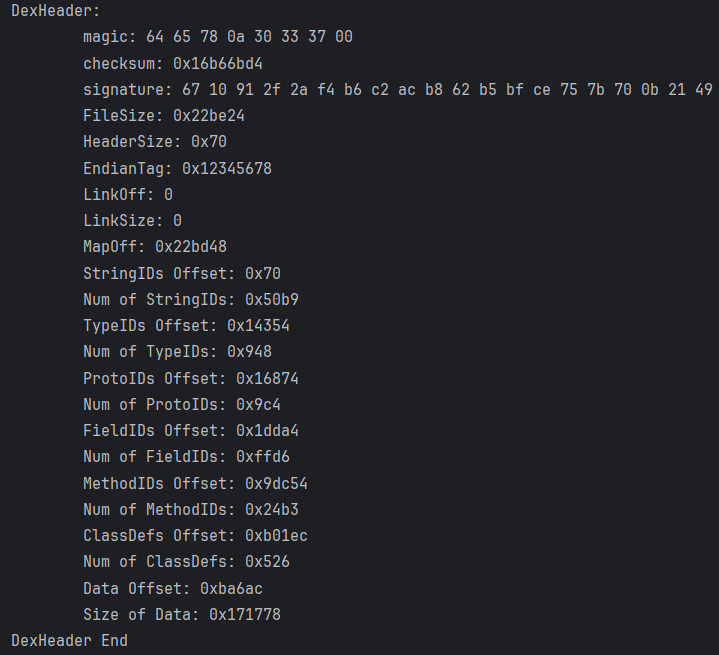

# Dex String ID

定义如下

```cpp
struct DexStringId {
    u4 stringDataOff;      /* 字符串的文件偏移量 */
};

//伪结构表示如下:
struct string_data_item {
 uleb128 utf16_size; //字符串长度
 ubyte[] data;       //字符串数据
}
```

注意dex文件的字符串采用MUTF-8编码,与UTF-8区别如下:

1. MUTF-8使用1~3字节编码
2. 大于16位的Unicode编码U+10000~U+10ffff使用3字节编码
3. U+000采用2字节编码
4. 以0x00空字符作为字符串结尾

MUTF-8字符串头部保存的是字符串长度,是uleb128类型

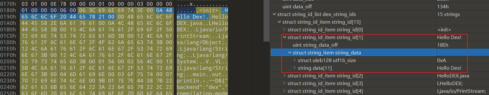

相关函数定义如下,解析StringId

```cpp
// StringId functions
// 通过索引获取对应StringId
DexStringId DexFile::getStringIdByIndex(u4 index) {
    if(checkIndexIsLegal(index,pHeader->stringIdsSize-1)) {
        return pStringIds[index];
    }
    printf("No such index: %x\n",index);
    exit(0);
}
// 解析StringId 获取字符串长度
size_t DexFile::getStringDataLength(DexStringId& stringId) {
    const u1* ptr = baseAddr + stringId.stringDataOff;
    size_t size=0;
    myReadUnsignedLeb128(ptr,&size);
    return size;
}
// 解析StringId 获取字符串
std::string DexFile::getStringIdData(const DexStringId& stringId) {
    const u1* ptr = baseAddr + stringId.stringDataOff;
    while (*(ptr++) > 0x7f);// Skip the uleb128 length.
    return (char*)ptr;
}
// 通过索引获取StringId的字符串
std::string DexFile::getStringIdDataByIndex(u4 index) {
    if(checkIndexIsLegal(index,pHeader->stringIdsSize-1)) {
        return getStringIdData(pStringIds[index]);
    }
    return nullptr;
}

```

打印所有StringId,没有做MUTF编码处理,直接打印ASCII字符串

```cpp
void DexFile::printStringIds() {
    printf("StringIds:\n");
    printf("\tNums\t\tStrings\n");
    for(int i=0;i<pHeader->stringIdsSize;i++) {
        printf("\t%08x\t%s\n",i,getStringIdDataByIndex(i).c_str());
    }
    printf("StringIds End\n");
}
```

效果如下,没有做编码处理故可能出现乱码

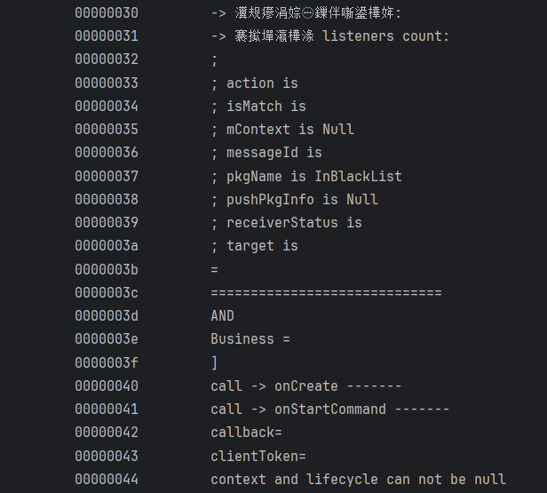

# Dex Type ID

定义如下

```cpp
typedef struct DexTypeId {
    u4  descriptorIdx;     //指向DexStringId列表的索引
} DexTypeId;
```

descriptorIdx为DexStringID表的索引,对应字符串表示类的类型

例如此处DexTypeID[3].descriptorIdx=6, 而DexStringID[6]对应的字符串为"Ljava/lang/String;"

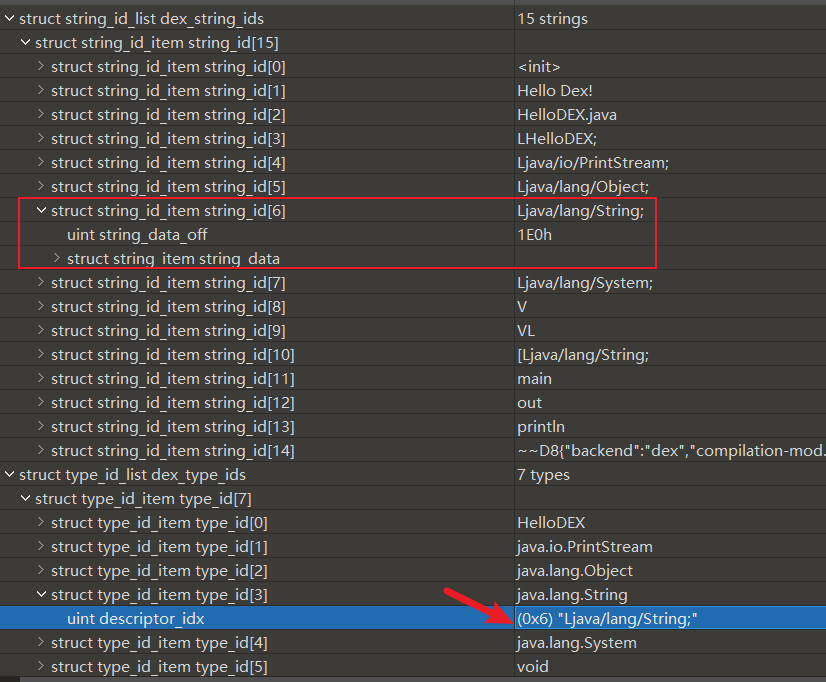

和StringId类似,TypeId的解析代码如下,通过索引获取StringId及其对应的字符串

```cpp
// TypeId functions
// 通过索引获取对应TypeId
DexTypeId DexFile::getTypeIdByIndex(u4 index) {
    if(checkIndexIsLegal(index,pHeader->typeIdsSize-1)) {
        return pTypeIds[index];
    }
    printf("No such index: %x\n",index);
    exit(0);
}
// 通过索引获取TypeId对应的字符串
std::string DexFile::getTypeIdDataByIndex(u4 index) {
    if(checkIndexIsLegal(index,pHeader->typeIdsSize-1)) {
        return getStringIdDataByIndex(pTypeIds[index].descriptorIdx);
    }
    return nullptr;
}
```

打印所有TypeId

```cpp
void DexFile::printTypeIds() {
    printf("TypeIds:\n");
    printf("\tNums\t\tTypeIds\n");
    for(int i=0;i<pHeader->typeIdsSize;i++) {
        printf("\t%08x\t%s\n",i,getTypeIdDataByIndex(i).c_str());
    }
    printf("TypeIds End\n");
}
```

效果如下

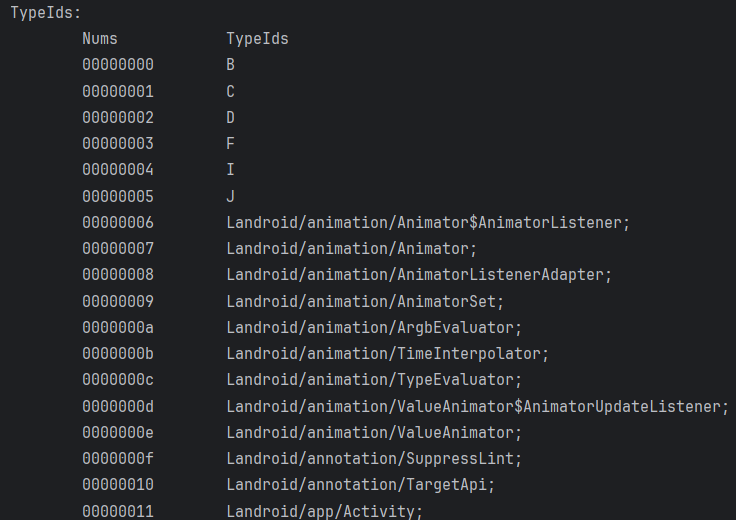

# Dex Proto ID

DexProtoId是**方法声明（方法签名）**的结构体,保存方法(函数)的返回值类型和参数类型列表,没有函数名,定义如下

```cpp
typedef struct DexProtoId {
    u4  shortyIdx;          //方法声明字符串,指向DexStringId列表的索引
    u4  returnTypeIdx;      //方法返回类型字符串,指向DexTypeId列表的索引
    u4  parametersOff;      //方法的参数列表,指向DexTypeList列表的索引
} DexProtoId;
```

parametersOff是DexTypeList的文件偏移

## DexTypeList

结构定义如下

```cpp
typedef struct DexTypeList {
    u4  size;               //DexTypeItem个数, 即参数个数
    DexTypeItem list[size]; //DexTypeItem数组, 按从左到右的顺序保存了方法的参数
} DexTypeList;

typedef struct DexTypeItem {
    u2  typeIdx;           //指向DexTypeId列表的索引
} DexTypeItem;
```

例如此处DexProtoID[1]

方法声明 DexStringID[shortyIdx]="VL" 

返回类型 DexStringID[DexTypeID[returnTypeIdx]]="V"

参数列表 DexStringID[DexTypeID[typeIdx]]="Ljava/lang/String;"

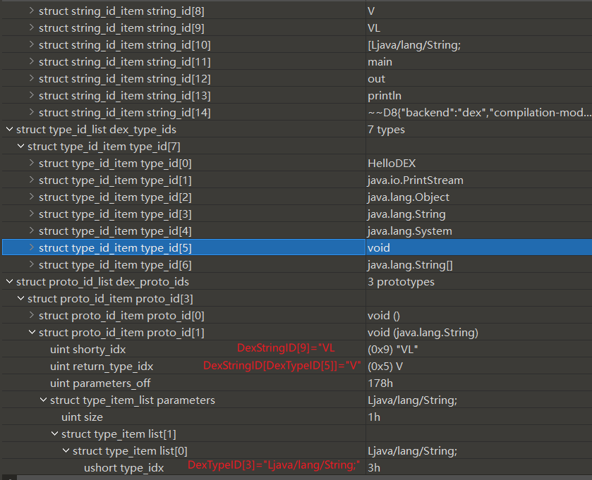

解析代码如下

```cpp
// ProtoId functions
const DexProtoId DexFile::getProtoIdByIndex(u4 index) {
    if(checkIndexIsLegal(index,pHeader->protoIdsSize-1)) {
        return pProtoIds[index];
    }
    illegalIndex(index);
}
std::string DexFile::getProtoIdShorty(const DexProtoId& protoId) {
    return getStringIdDataByIndex(protoId.shortyIdx);
}
std::string DexFile::getProtoIdReturnType(const DexProtoId& protoId) {
    return getTypeIdDataByIndex(protoId.returnTypeIdx);
}
// 获取ProtoId的参数列表,解析TypeList结构
std::vector<std::string> DexFile::getProtoIdParameters(const DexProtoId& protoId) {
    std::vector<std::string> parameters;
    //无参数
    if(protoId.parametersOff==0) {
        return parameters;
    }
    //解析TypeList结构 获取参数列表
    DexTypeList* typeList=(DexTypeList*)(baseAddr+protoId.parametersOff);
    for(int i=0;i<typeList->size;i++) {
        parameters.push_back(getTypeIdDataByIndex(typeList->list[i].typeIdx));
    }
    return parameters;
}
// 解析DexProtoId结构体 返回解析后的字符串
std::string DexFile::parseProtoId(const DexProtoId& protoId) {
    std::string shorty=getProtoIdShorty(protoId);//c++的string类型会自动遍历const char*字符串并复制
    std::string return_type = getProtoIdReturnType(protoId);
    std::vector<std::string> parameters=getProtoIdParameters(protoId);

    std::string result;
    result+=parseString(return_type)+" (";
    //解析参数
    for(int i=0;i<parameters.size();i++) {
        result+=parseString(parameters[i]);
        if(i!=parameters.size()-1)//多个参数以,分隔
            result+=",";
    }
    result+=")";
    return result;
}
// 通过索引解析ProtoId,返回解析后的对应字符串
std::string DexFile::getProtoIdDataByIndex(u4 index) {
    if(checkIndexIsLegal(index,pHeader->protoIdsSize-1)) {
        return parseProtoId(getProtoIdByIndex(index));
    }
    return nullptr;
}

```

打印所有ProtoId

```cpp
void DexFile::printProtoIds() {
    printf("ProtoIds:\n");
    printf("\tNums\t\tProtoIds\n");
    for(int i=0;i<pHeader->protoIdsSize;i++) {
        printf("\t%08x\t%s\n",i,getProtoIdDataByIndex(i).c_str());
    }
    printf("ProtoIds End\n");
}
```

效果如下

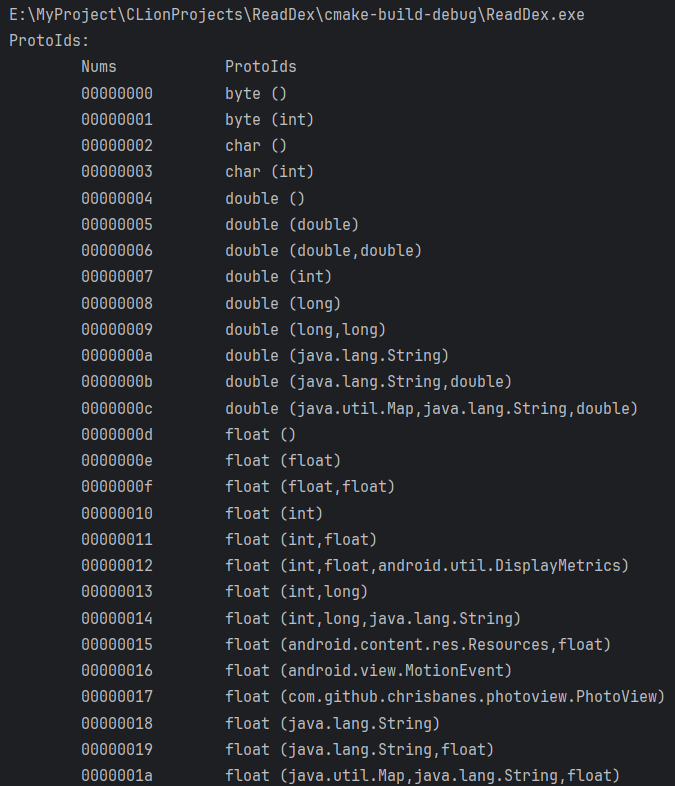

# Dex Field ID

DexFieldID结构体指明了成员变量所在的类,类型以及变量名

```cpp
typedef struct DexFieldId {
    u2  classIdx;           //类的类型,指向DexTypeId列表的索引
    u2  typeIdx;            //字段类型,指向DexTypeId列表的索引
    u4  nameIdx;            //字段名,指向DexStringId列表的索引
} DexFieldId;
```

寻找方法类似,out是java.lang.System类的成员,类型为java.io.PrintStream

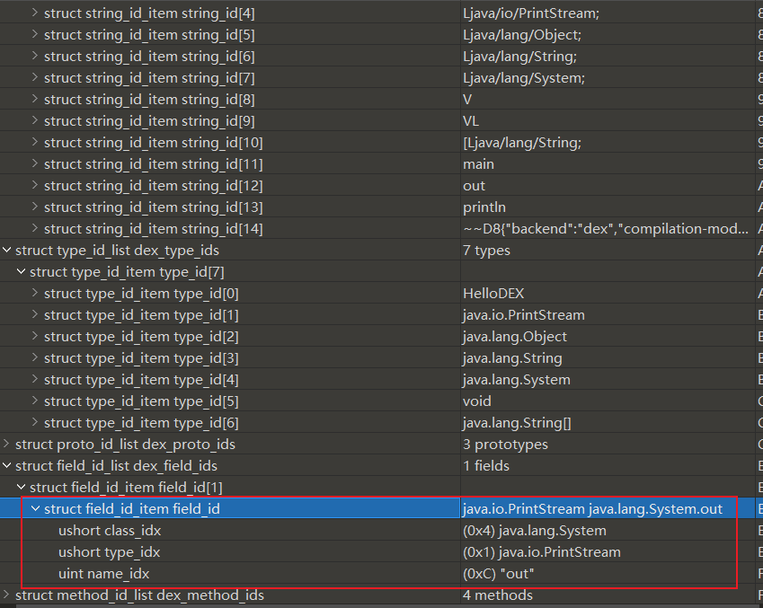

解析代码如下

```cpp
// FieldId functions
const DexFieldId DexFile::getFieldIdByIndex(u4 index) {
    if(checkIndexIsLegal(index,pHeader->fieldIdsSize-1)) {
        return pFieldIds[index];
    }
    illegalIndex(index);
}
// 获取FieldId所在类类名
std::string DexFile::getFieldIdClass(const DexFieldId& fieldId) {
    return getTypeIdDataByIndex(fieldId.classIdx);
}
// 获取FieldId类型
std::string DexFile::getFieldIdType(const DexFieldId& fieldId) {
    return getTypeIdDataByIndex(fieldId.typeIdx);
}
// 获取FieldId名称
std::string DexFile::getFieldIdName(const DexFieldId& fieldId) {
    return getStringIdDataByIndex(fieldId.nameIdx);
}
// 解析DexFieldId结构,字段所在类,类型,名称
std::string DexFile::parseFieldId(const DexFieldId& fieldId) {
    std::string fieldClass=getFieldIdClass(fieldId);
    std::string fieldType=getFieldIdType(fieldId);
    std::string fieldName=getFieldIdName(fieldId);
    return parseString(fieldType)+" "+parseString(fieldClass)+"."+fieldName;
}
// 通过索引获取FieldId对应的字符串
std::string DexFile::getFieldIdDataByIndex(u4 index) {
    if(checkIndexIsLegal(index,pHeader->fieldIdsSize-1)) {
        return parseFieldId(getFieldIdByIndex(index));
    }
    return nullptr;
}
```

打印所有ProtoId

```cpp
void DexFile::printFieldIds() {
    printf("FieldIds:\n");
    printf("\tNums\t\tFieldIds\n");
    for(int i=0;i<pHeader->fieldIdsSize;i++) {
        printf("\t%08x\t%s\n",i,getFieldIdDataByIndex(i).c_str());
    }
    printf("FieldId End\n");
}
```

效果如下

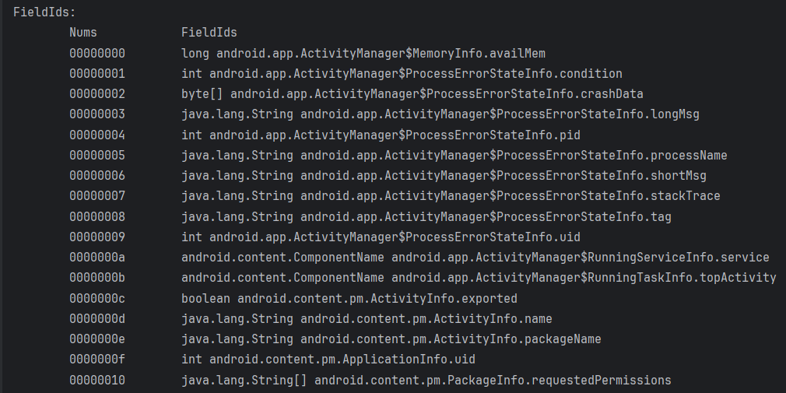

# Dex Method ID

DexMethodId结构体指明了方法所在的类、方法声明（签名）以及方法名, 即完整的方法声明

```cpp
struct DexMethodId {
    u2  classIdx;           /* 方法的所属的类，指向DexTypeId列表的索引 */
    u2  protoIdx;           /* 声明类型，指向DexProtoId列表的索引 */
    u4  nameIdx;            /* 方法名，指向DexStringId列表的索引 */
};
```

寻找方法

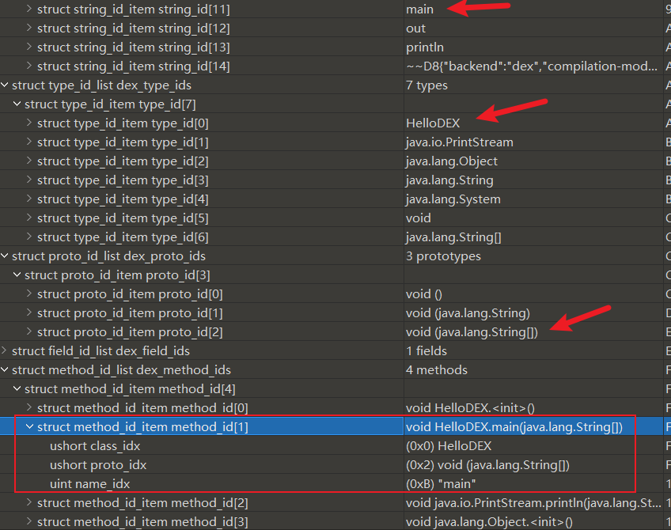

对应解析代码如下

```cpp
// MethodId functions
const DexMethodId DexFile::getMethodIdByIndex(u4 index) {
    if(checkIndexIsLegal(index,pHeader->methodIdsSize-1)) {
        return pMethodIds[index];
    }
    illegalIndex(index);
}
// 获取MethodId所在类名
std::string DexFile::getMethodIdClass(const DexMethodId& methodId) {
    return getTypeIdDataByIndex(methodId.classIdx);
}
// 获取MethodId对应方法签名
std::string DexFile::getMethodIdProto(const DexMethodId& methodId) {
    return getProtoIdDataByIndex(methodId.protoIdx);
}
// 获取MethodId对应方法名
std::string DexFile::getMethodIdName(const DexMethodId& methodId) {
    return getStringIdDataByIndex(methodId.nameIdx);
}
// 解析DexMethodId结构
std::string DexFile::parseMethodId(const DexMethodId& methodId) {
    std::string methodProto=getMethodIdProto(methodId);
    //解析class并拼接name
    std::string methodFullName=parseString(getMethodIdClass(methodId))+getMethodIdName(methodId);
    //拼接proto和class.name
    return methodProto.insert(methodProto.find(' ')+1,methodFullName);
}
// 通过索引获取MethodId对应字符串
std::string DexFile::getMethodIdDataByIndex(u4 index) {
    if(checkIndexIsLegal(index,pHeader->methodIdsSize-1)) {
        return parseMethodId(getMethodIdByIndex(index));
    }
    return nullptr;
}
```

打印所有MethodId

```cpp
void DexFile::printMethodIds() {
    printf("MethodIds:\n");
    printf("\tNums\t\tMethodIds\n");
    for(int i=0;i<pHeader->methodIdsSize;i++) {
        printf("\t%08x\t%s\n",i,getMethodIdDataByIndex(i).c_str());
    }
    printf("MethodIds End\n");
}
```

效果如下

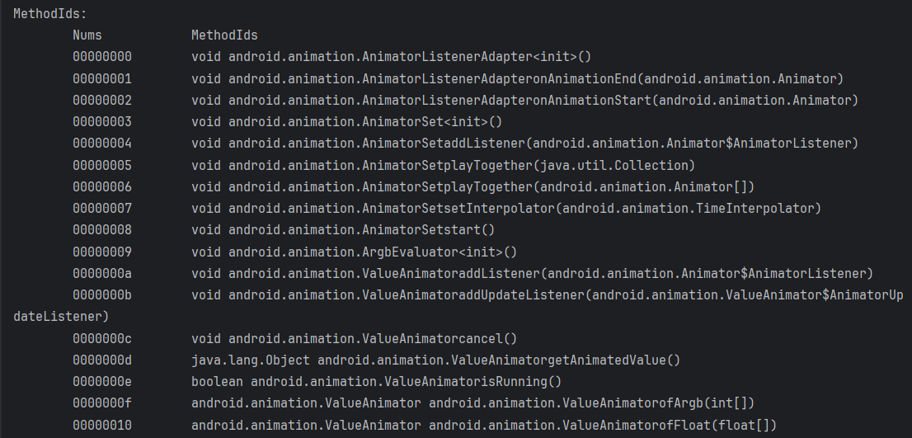

# Dex Map List

Dalvik虚拟机解析dex文件后,映射为DexMapList的数据结构, 该结构由DexHeader.mapOff指明位置

```cpp
struct DexMapList {
    u4  size;               /* DexMapItem个数 */
    DexMapItem list[1];     /* DexMapItem数组 */
};

struct DexMapItem {
    u2 type;              /* KDexType开头的类型 */
    u2 unused;			  /* 未使用，用于字节对齐 */
    u4 size;              /* 类型的个数 */
    u4 offset;            /* 类型数据的文件偏移 */
};
```

type是枚举常量,用于判断类型

```cpp
/* map item type codes */
enum {
    kDexTypeHeaderItem               = 0x0000,
    kDexTypeStringIdItem             = 0x0001,
    kDexTypeTypeIdItem               = 0x0002,
    kDexTypeProtoIdItem              = 0x0003,
    kDexTypeFieldIdItem              = 0x0004,
    kDexTypeMethodIdItem             = 0x0005,
    kDexTypeClassDefItem             = 0x0006,
    kDexTypeCallSiteIdItem           = 0x0007,
    kDexTypeMethodHandleItem         = 0x0008,
    kDexTypeMapList                  = 0x1000,
    kDexTypeTypeList                 = 0x1001,
    kDexTypeAnnotationSetRefList     = 0x1002,
    kDexTypeAnnotationSetItem        = 0x1003,
    kDexTypeClassDataItem            = 0x2000,
    kDexTypeCodeItem                 = 0x2001,
    kDexTypeStringDataItem           = 0x2002,
    kDexTypeDebugInfoItem            = 0x2003,
    kDexTypeAnnotationItem           = 0x2004,
    kDexTypeEncodedArrayItem         = 0x2005,
    kDexTypeAnnotationsDirectoryItem = 0x2006,
};
```

size指定了类型个数,在dex文件中连续存放, offset是起始地址文件偏移

例如DexMapList[1] type=string_id_item, size=0xF, offset=0x70

和DexStringID表正好对应,起始地址,表项数

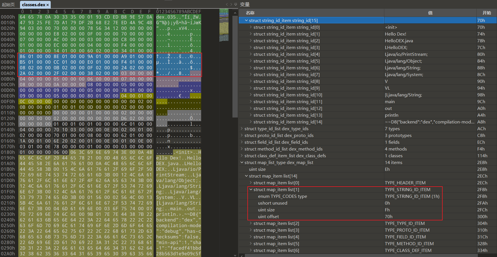

解析代码如下

```cpp
void DexFile::printMapList() {
    static std::map<int, std::string> MapItemTypeToStringMap = {
        {kDexTypeHeaderItem, "HeaderItem"},
        {kDexTypeStringIdItem, "StringIdItem"},
        {kDexTypeTypeIdItem, "TypeIdItem"},
        {kDexTypeProtoIdItem, "ProtoIdItem"},
        {kDexTypeFieldIdItem, "FieldIdItem"},
        {kDexTypeMethodIdItem, "MethodIdItem"},
        {kDexTypeClassDefItem, "ClassDefItem"},
        {kDexTypeMapList, "MapList"},
        {kDexTypeTypeList, "TypeList"},
        {kDexTypeAnnotationSetRefList, "AnnotationSetRefList"},
        {kDexTypeAnnotationSetItem, "AnnotationSetItem"},
        {kDexTypeClassDataItem, "ClassDataItem"},
        {kDexTypeCodeItem, "CodeItem"},
        {kDexTypeStringDataItem, "StringDataItem"},
        {kDexTypeDebugInfoItem, "DebugInfoItem"},
        {kDexTypeAnnotationItem, "AnnotationItem"},
        {kDexTypeEncodedArrayItem, "EncodedArrayItem"},
        {kDexTypeAnnotationsDirectoryItem, "AnnotationsDirectoryItem"}
    };

    DexMapList* pMapList=(DexMapList*)(baseAddr+pHeader->mapOff);
    DexMapItem* pMapItems=pMapList->list;
    printf("MapList has %d items, start at: %#x\n",pMapList->size,pHeader->mapOff);
    printf("Nums\t\tType\t\t\t\tItemNums\tStartOff\n");
    for(int i=0;i<pMapList->size;i++) {
        // 解析MapType
        auto it=MapItemTypeToStringMap.find(pMapItems[i].type);
        std::string mapType;
        if(it!= MapItemTypeToStringMap.end())
            mapType=it->second;
        else mapType="Unknown Type";
        printf("%08d\t%-24s\t%08d\t%08x\n",i+1,mapType.c_str(),pMapItems[i].size,pMapItems[i].offset);
    }
    printf("MapList End\n");
}
```

打印效果如下

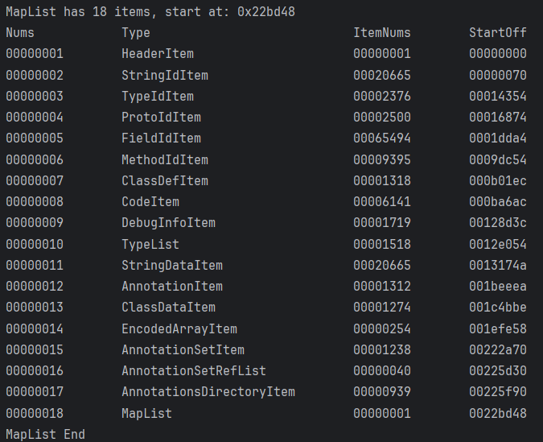

# Dex Class Def

该结构较为复杂(这部分相关代码比前文所有结构代码之和都大)

有了对Dex文件的基本了解和上面各个结构的基础,才能解析该结构

DexClassDef保存了类的相关信息,定义如下

```cpp
struct DexClassDef {
    u4  classIdx;           /* 类的类型（即全限定类名），指向DexTypeId列表的索引 */
    u4  accessFlags;		/* 访问标志，以ACC_开头的枚举值，如ACC_PUBLIC（0x1）、ACC_PRIVATE（0x2）*/
    u4  superclassIdx;      /* 父类类型，指向DexTypeId列表的索引*/
    u4  interfacesOff;      /* 接口，指向DexTypeList的文件偏移，如果类中不含有接口声明和实现，则值为0 */
    u4  sourceFileIdx;      /* 类所在源文件的文件名，指向DexStringId列表的索引 */
    u4  annotationsOff;     /* 注解，指向DexAnnotationsDirectoryItem结构体，根据类型不同会有注解类、注解方法、注解字段与注解参数，如果类中没有注解，则值为0 */
    u4  classDataOff;       /* 指向DexClassData结构的文件偏移，DexClassData结构是类的数据部分 */
    u4  staticValuesOff;    /* 指向DexEncodedArray结构的文件偏移，记录类中的静态数据, 没有则为0 */
};
```

解析代码如下

将ClassDef结构划分为4部分解析: BasicInfo, Annotations, ClassData, StaticValues, 从classIdx到sourceFileIx属于BasicInfo

每部分使用单独的打印函数进行处理

```cpp
// 打印所有ClassDef信息
void DexFile::printClassDefs() {
    printf("ClassDefs:\n");
    for(int i=0;i<pHeader->classDefsSize;i++) {
        DexClassDef classDef=pClassDefs[i];
        // 1.Basic info
        printf("=========================ClassDef %08d=========================\n",i+1);
        printClassDefBasicInfo(classDef);

        // 2. Annotations
        if(classDef.annotationsOff) {
            printf("Annotations:\n");
            printClassDefAnnotations(*(DexAnnotationsDirectoryItem*)(baseAddr+classDef.annotationsOff));
                // 值传递只保留前16字节导致内存访问错,需要引用传递
                // DexAnnotationsDirectoryItem annotations_directory_item=*(DexAnnotationsDirectoryItem*)(baseAddr+classDef.annotationsOff);
                // parseClassDefAnnotations(annotations_directory_item);
        }
        else
            printf("No Annotations\n");
        // 3. ClassData
        if(classDef.classDataOff) {
            printClassDefClassData(*(DexClassData*)(baseAddr+classDef.classDataOff));
        }else
            printf("No ClassData\n");
        // 4. StaticValues
        if(classDef.staticValuesOff) {
            printClassDefStaticValues(*(DexEncodedArray*)(baseAddr+classDef.staticValuesOff));
        }else
            printf("No StaticValues\n");
        printf("===================================================================\n");
    }
    printf("ClassDefs End\n");
}

```

## ClassDefBasicInfo

代码如下

```cpp
// ClassDef Basic Info functions
// 获取class
std::string DexFile::getClassDefClass(DexClassDef& classDef) {
    return parseString(getTypeIdDataByIndex(classDef.classIdx));
}
// 解析权限修饰符
std::string DexFile::parseAccessFlags(u4 accessFlags) {
    static std::map<int, std::string> AccessFlagMap = {
        {ACC_PUBLIC, "public"},
        {ACC_PRIVATE, "private"},
        {ACC_PROTECTED, "protected"},
        {ACC_STATIC, "static"},
        {ACC_FINAL, "final"},
        {ACC_SYNCHRONIZED, "synchronized"},
        {ACC_SUPER, "super"},
        {ACC_VOLATILE, "volatile"},
        {ACC_BRIDGE, "bridge"},
        {ACC_TRANSIENT, "transient"},
        {ACC_VARARGS, "varargs"},
        {ACC_NATIVE, "native"},
        {ACC_INTERFACE, "interface"},
        {ACC_ABSTRACT, "abstract"},
        {ACC_STRICT, "strict"},
        {ACC_SYNTHETIC, "synthetic"},
        {ACC_ANNOTATION, "annotation"},
        {ACC_ENUM, "enum"},
        {ACC_CONSTRUCTOR, "constructor"},
        {ACC_DECLARED_SYNCHRONIZED, "declared_synchronized"}
    };
    std::string result;
    for(int i=0;i<32;i++) {
        if(accessFlags & (1 << i)) {
            result+=AccessFlagMap[1 << i]+" ";//遍历添加权限控制属性
        }
    }
    if(!result.empty())
        result=result.substr(0,result.length()-1);//去除末尾多余空格
    return result;
}
// 获取父类
std::string DexFile::getClassDefSuperClass(DexClassDef& classDef) {
    return parseString(getTypeIdDataByIndex(classDef.superclassIdx));
}
// 获取接口列表
std::vector<std::string> DexFile::getClassDefInterfaces(DexClassDef& classDef) {
    std::vector<std::string> interfaces;
    //无参数
    if(classDef.interfacesOff==0) {
        return interfaces;
    }
    DexTypeList* typeList=(DexTypeList*)(baseAddr+classDef.interfacesOff);
    for(int i=0;i<typeList->size;i++) {
        interfaces.push_back(getTypeIdDataByIndex(typeList->list[i].typeIdx));
    }
    return interfaces;
}
// 获取源文件
std::string DexFile::getClassDefSourceFile(DexClassDef& classDef) {
    return getStringIdDataByIndex(classDef.sourceFileIdx);
}
// 打印ClassDef结构的基本信息: 类名 父类 源文件名 接口
void DexFile::printClassDefBasicInfo(DexClassDef& classDef) {
    std::string className=getClassDefClass(classDef);
    std::string accessFlags=parseAccessFlags(classDef.accessFlags);
    std::string superClass=getClassDefSuperClass(classDef);
    std::vector<std::string> interfaces=getClassDefInterfaces(classDef);
    std::string sourceFile=getClassDefSourceFile(classDef);

    // Basic info, class super_class source_file interfaces
    printf("Class:\t\t%s\n",combineAccFlagsAndName(accessFlags,className).c_str());
    printf("Super Class:\t%s\n",superClass.c_str());
    printf("Source File:\t%s\n",sourceFile.c_str());

    // print interfaces if have it
    if(!interfaces.empty()) {
        printf("Interfaces:\nNums\t\tInterface\n");
        for(int j=0;j<interfaces.size();j++) {
            printf("%08d\t%s\n",j+1,parseString(interfaces[j]).c_str());
        }
    }else {
        printf("No Interfaces\n");
    }
}
```

效果如下

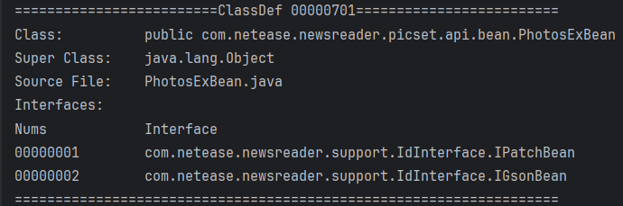

## DexAnnotationsDirectoryItem

annotationsOff指向该结构,用于指向类的所有注解,定义如下

```cpp
struct DexAnnotationsDirectoryItem {
    u4  classAnnotationsOff;  /* 类注解，值为DexAnnotationSetItem的文件偏移量, 为0表示不存在*/
    u4  fieldsSize;           /* 域注解，值为DexFieldAnnotationsItem的数量 */
    u4  methodsSize;          /* 方法注解，值为DexMethodAnnotationsItem的数量 */
    u4  parametersSize;       /* 参数注解。值为DexParameterAnnotationsItem的数量 */
    /* 后3结构中存在1个或多个，则在后面追加以下数据，并按顺序排列 */
    /* followed by DexFieldAnnotationsItem[fieldsSize] */
    /* followed by DexMethodAnnotationsItem[methodsSize] */
    /* followed by DexParameterAnnotationsItem[parametersSize] */
};
```

printClassDefAnnotations函数用于打印该结构,根据不同注解类型调用不同函数解析

```cpp
// 打印ClassDef的所有Annotations
void DexFile::printClassDefAnnotations(DexAnnotationsDirectoryItem& annotationsDirectory) {
    //1. 类注解
    if(annotationsDirectory.classAnnotationsOff)
        printClassAnnotations(*(DexAnnotationSetItem*)(baseAddr+annotationsDirectory.classAnnotationsOff));
    else
        printf("No Class Annotations\n\n");

    //2. 域(字段)注解
    if(annotationsDirectory.fieldsSize) {
        printFieldAnnotations(
            (DexFieldAnnotationsItem*)((uintptr_t)&annotationsDirectory
                +sizeof(DexAnnotationsDirectoryItem))
                ,annotationsDirectory.fieldsSize);
    }else
        printf("No Field Annotations\n\n");

    //3. 方法注解
    if(annotationsDirectory.methodsSize) {
        printMethodAnnotations(
            (DexMethodAnnotationsItem*)
            ((uintptr_t)&annotationsDirectory
            +sizeof(DexAnnotationsDirectoryItem)
            +sizeof(DexFieldAnnotationsItem)*annotationsDirectory.fieldsSize)
            ,annotationsDirectory.methodsSize);
    }else {
        printf("No Method Annotations\n\n");
    }
    //4. 参数注解
    if(annotationsDirectory.parametersSize) {
        printParameterAnnotations(
            (DexParameterAnnotationsItem*)((uintptr_t)&annotationsDirectory
            +sizeof(DexAnnotationsDirectoryItem)
            +sizeof(DexFieldAnnotationsItem)*annotationsDirectory.fieldsSize
            +sizeof(DexMethodAnnotationsItem)*annotationsDirectory.methodsSize)
            ,annotationsDirectory.parametersSize);
    }else {
        printf("No Parameter Annotations\n\n");
    }
}
```


### 类注解 DexAnnotationSetItem

```cpp
struct DexAnnotationSetItem {
    u4  size;						/* DexAnnotationItem的数量 */
    u4  entries[1];                 /* entries数组,存储DexAnnotationItem的文件偏移量 */
};

struct DexAnnotationItem {
    u1  visibility;					/* 此注释的预期可见性 */
    u1  annotation[1];              /* encoded_annotation格式的注释内容 */
};
```

visibility表示注释的可见性，主要有以下几种情况：

| 名称               | 值   | 说明                                                       |
| :----------------- | :--- | :--------------------------------------------------------- |
| VISIBILITY_BUILD   | 0x00 | 预计仅在构建（例如，在编译其他代码期间）时可见             |
| VISIBILITY_RUNTIME | 0x01 | 预计在运行时可见                                           |
| VISIBILITY_SYSTEM  | 0x02 | 预计在运行时可见，但仅对基本系统（而不是常规用户代码）可见 |

annotation是采用encoded_annotation格式的注释内容, **encoded_annotation格式**如下：

| 名称     | 格式                     | 说明                                                         |
| :------- | :----------------------- | :----------------------------------------------------------- |
| type_idx | uleb128                  | 注解的类型，指向DexTypeId列表的索引值                        |
| size     | uleb128                  | 此注解中 name-value 映射的数量                               |
| elements | annotation_element[size] | 注解的元素，直接以内嵌形式（不作为偏移量）表示。元素必须按 `string_id` 索引以升序进行排序。 |

**annotation_element元素格式**如下：

| 名称     | 格式          | 说明                                  |
| :------- | :------------ | :------------------------------------ |
| name_idx | uleb128       | 元素名称，指向DexStringId列表的索引值 |
| value    | encoded_value | 元素值                                |

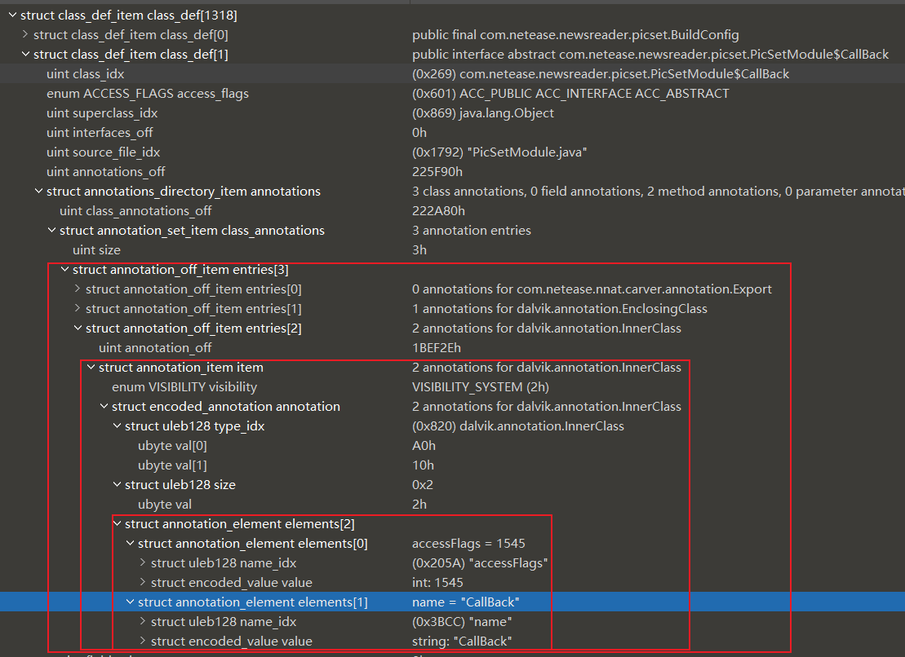

解析代码如下

```cpp
// Annotation functions
// 将权限修饰符和方法/类名组合
std::string DexFile::combineAccFlagsAndName(std::string accFlags,std::string name) {
    std::string result;
    if(accFlags.empty())
        result=name;//无权限控制关键字,完整名即可
    else
        result=accFlags+" "+name;
    return result;
}
// 打印DexAnnotationItem结构信息
void DexFile::printAnnotation(DexAnnotationItem& annotationItem) {
    std::string visibility;//注解可见性
    switch(annotationItem.visibility) {
        case kDexVisibilityBuild: visibility="build";break;
        case kDexVisibilityRuntime:visibility="runtime";break;
        case kDexVisibilitySystem:visibility="system";break;
        default:visibility="unknown";
    }
    // 解析encoded_annotation
    u1* pAnnotation=annotationItem.annotation;
    size_t typeSize=0,sizeSize=0;
    u4 encoded_annotation_type_idx=myReadUnsignedLeb128(pAnnotation,&typeSize);//注解类型偏移
    u4 encoded_annotation_size=myReadUnsignedLeb128(pAnnotation+typeSize,&sizeSize);//注解name-value映射数
    std::string encoded_annotation_type=parseString(getTypeIdDataByIndex(encoded_annotation_type_idx));

    //Size Visibility Type
    printf("%08d\t%s\t\t%s\n",encoded_annotation_size,visibility.c_str(),encoded_annotation_type.c_str());

    // 解析encoded_annotation.elements
    u1* pAnnotationElements=pAnnotation+typeSize+sizeSize;
    for(int i=0;i<encoded_annotation_size;i++) {
        size_t name_idx_size=0;// name_idx
        std::string name=parseString(getStringIdDataByIndex(myReadUnsignedLeb128(pAnnotationElements,&name_idx_size)));
        size_t valueSize=0;
        std::string value=parseString(parseEncodedValue(pAnnotationElements+name_idx_size,valueSize));
        printf("\t%s=%s\n",name.c_str(),value.c_str());
    }
}
// 打印DexAnnotationSetItem信息 即多个DexAnnotationItem结构
void DexFile::printAnnotationSet(DexAnnotationSetItem& annotationSet) {
    printf("Size\t\tVisibility\tType\n");
    //AnnotationSetItem.entries[] 数组保存AnnotationItem结构的文件偏移值
    for(int j=0;j<annotationSet.size;j++) {
        printAnnotation(*(DexAnnotationItem*)(annotationSet.entries[j]+baseAddr));
    }
}
// 打印所有类注解 DexAnnotationSetItem
void DexFile::printClassAnnotations(DexAnnotationSetItem& classAnnotations) {
    printf("Class Annotations start at %#llx, contains %d entries\n",(uintptr_t)classAnnotations.entries-(uintptr_t)baseAddr,classAnnotations.size);
    printAnnotationSet(classAnnotations);
    printf("Class Annotations End\n\n");
}
```

效果如下, 打印类注解及其包含的encoded_element内容

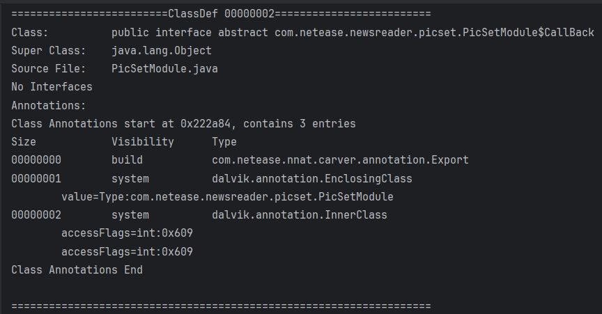

### 域注解 DexFieldAnnotationsItem

定义如下

```cpp
struct DexFieldAnnotationsItem {
    u4  fieldIdx;					/* 指向DexFieldId列表的索引值 */
    u4  annotationsOff;             /* DexAnnotationSetItem的文件偏移量 */
};
```

由于指向DexAnnotationSetItem结构,故解析方式和类注解类似

```cpp
// 打印所有域注解 DexFieldAnnotationsItem
void DexFile::printFieldAnnotations(DexFieldAnnotationsItem* pFieldAnnotations,u4 fieldsNum) {
    printf("Field Annotations start at %#llx, contains %d entries\n",(uintptr_t)pFieldAnnotations-(uintptr_t)baseAddr,fieldsNum);
    for(int i=0;i<fieldsNum;i++) {
        std::string field=getFieldIdDataByIndex(pFieldAnnotations[i].fieldIdx);
        printf("Field%d:\t%s\n",i+1,field.c_str());
        printAnnotationSet(*(DexAnnotationSetItem*)(baseAddr+pFieldAnnotations[i].annotationsOff));
    }
    printf("Field Annotations End\n\n");
}
```

效果如下

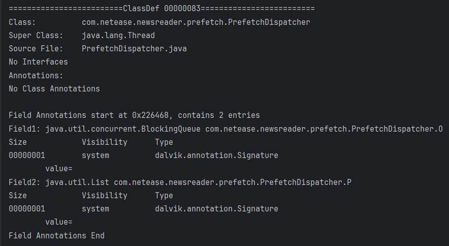

### 方法注解 DexMethodAnnotationsItem

定义如下

```cpp
/*
 * Direct-mapped "method_annotations_item".
 */
struct DexMethodAnnotationsItem {
    u4  methodIdx;					/* 指向DexMethodId列表的索引值 */
    u4  annotationsOff;             /* DexAnnotationSetItem的文件偏移量 */
};
```

解析方法类似

```cpp
// 打印方法注解 DexMethodAnnotationsItem
void DexFile::printMethodAnnotations(DexMethodAnnotationsItem* pMethodAnnotations,u4 methodsNum) {
    printf("Method Annotations start at %#llx, contains %d entries\n",(uintptr_t) pMethodAnnotations-(uintptr_t)baseAddr,methodsNum);
    for(int i=0;i<methodsNum;i++) {
        std::string method=getMethodIdDataByIndex(pMethodAnnotations[i].methodIdx);
        printf("Method%d:\t%s\n",i+1,method.c_str());
        printAnnotationSet(*(DexAnnotationSetItem*)(baseAddr+ pMethodAnnotations[i].annotationsOff));
    }
    printf("Method Annotations End\n\n");
}
```

效果如下


### 参数注解 DexParameterAnnotationsItem

定义如下

```cpp
/*
 * Direct-mapped "parameter_annotations_item".
 */
struct DexParameterAnnotationsItem {
    u4  methodIdx;					/* 指向DexMethodId列表的索引值 */
    u4  annotationsOff;             /* DexAnotationSetRefList的文件偏移量 */
};
```

DexAnotationSetRefList结构体定义如下

```cpp
/*
 * Direct-mapped "annotation_set_ref_list".
 */
struct DexAnnotationSetRefList {
    u4  size;							/* 列表中元素个数，即DexAnnotationSetRefItem的个数 */
    DexAnnotationSetRefItem list[1];	/* 第一个DexAnnotationSetRefItem的内容，非偏移量 */
};

/*
 * Direct-mapped "annotation_set_ref_item".
 */
struct DexAnnotationSetRefItem {
    u4  annotationsOff;             /* DexAnnotationSetItem的偏移量 */
};
```

解析方法略有不同,代码如下

```cpp
// 打印DexAnnotationSetRefList
void DexFile::printAnnotationSetRefList(DexAnnotationSetRefList& annotationSetRefList) {
    printf("AnnotationSetRefList contains %d AnnotationSetItems\n",annotationSetRefList.size);
    // AnnotationSetRefList.list是AnnotationSetRefItem数组
    DexAnnotationSetRefItem* pAnnotationSetRefItem=annotationSetRefList.list;
    for(int i=0;i<annotationSetRefList.size;i++) {
        if(!pAnnotationSetRefItem[i].annotationsOff) {
            printf("No This Annotation Set!\n");//可能存在空项
            continue;
        }
        //AnnotationSetRefItem.annotationsOff指向AnnotationSetItem结构
        printAnnotationSet(*(DexAnnotationSetItem*)(baseAddr+pAnnotationSetRefItem[i].annotationsOff));
    }
    printf("AnnotationSetRefList End\n");
}
// 打印参数注解 DexParameterAnnotationsItem
void DexFile::printParameterAnnotations(DexParameterAnnotationsItem* pParameterAnnotations,u4 parametersNum) {
    printf("Parameter Annotations start at %#llx, contains %d entries\n",(uintptr_t) pParameterAnnotations-(uintptr_t)baseAddr,parametersNum);
    for(int i=0;i<parametersNum;i++) {
        std::string method=getMethodIdDataByIndex(pParameterAnnotations[i].methodIdx);
        printf("Method%d:\t%s\n",i+1,method.c_str());
        // PatameterAnnotationsItem.annotationsOff指向DexAnnotationSetRefList结构,和其他三个不同
        printAnnotationSetRefList(*(DexAnnotationSetRefList*)(baseAddr+pParameterAnnotations[i].annotationsOff));
        printf("\n");
    }
    printf("Parameter Annotations End\n\n");
}
```

效果如下

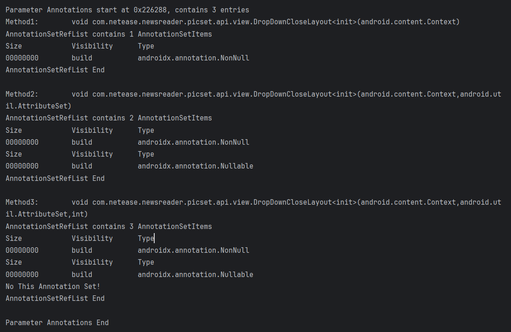

## DexClassData

定义在http://androidxref.com/2.3.7/xref/dalvik/libdex/DexClass.h中

注意: **DexClass.h定义的结构体中,u4类型实际类型为uleb128**

```cpp
/* expanded form of class_data_item. Note: If a particular item is
 * absent (e.g., no static fields), then the corresponding pointer
 * is set to NULL. */
typedef struct DexClassData {
    DexClassDataHeader header;
    DexField*          staticFields;	//下面4个连续数组,如果对应长度存在才有效
    DexField*          instanceFields;	//按顺序排列	
    DexMethod*         directMethods;
    DexMethod*         virtualMethods;
} DexClassData;
```

内部的结构体定义如下:

注意u4均为uleb128,所以这些结构大小不固定,无法通过sizeof计算,需要手动计算

```cpp
/* expanded form of a class_data_item header */
typedef struct DexClassDataHeader {
    u4 staticFieldsSize;
    u4 instanceFieldsSize;
    u4 directMethodsSize;
    u4 virtualMethodsSize;
} DexClassDataHeader;

/* expanded form of encoded_field */
typedef struct DexField {
    u4 fieldIdx;    /* index to a field_id_item */
    u4 accessFlags;
} DexField;

/* expanded form of encoded_method */
typedef struct DexMethod {
    u4 methodIdx;    /* index to a method_id_item */
    u4 accessFlags;
    u4 codeOff;      /* file offset to a code_item */
} DexMethod;
```

其中codeOff指向DexCode结构,定义如下

```cpp
/*
 * Direct-mapped "code_item".
 *
 * The "catches" table is used when throwing an exception,
 * "debugInfo" is used when displaying an exception stack trace or
 * debugging. An offset of zero indicates that there are no entries.
 */
struct DexCode {
    u2  registersSize;		/* 使用的寄存器个数 */
    u2  insSize;			/* 参数个数 */
    u2  outsSize;			/* 调用其他方法时使用的寄存器个数 */
    u2  triesSize;			/* try_item的个数 */
    u4  debugInfoOff;       /* 指向调试信息的文件偏移量 */
    u4  insnsSize;          /* 指令集个数，以2字节为单位 */
    u2  insns[1];			/* 指令集，insns 数组中的代码格式由随附文档 Dalvik 字节码指定 */
    /* 如果 triesSize 不为零，下面存在*/
    /* 两字节填充，使下面的try_item实现4字节对齐 */
    /* followed by try_item[triesSize]，用于表示代码中捕获异常的位置以及如何对异常进行处理的数组 */
    /* followed by uleb128 handlersSize */
    /* followed by catch_handler_item[handlersSize]，用于表示“捕获类型列表和关联处理程序地址”的列表的字节 */
};
```

解析代码如下,

```cpp
// 打印DexCode Todo: 解析DexCode字段
void DexFile::printDexCode(DexCode& dexCode) {
    // 打印基本信息
    printf("DexCode:\n");
    printf("RegsNum\t\tParamsNum\tOutsNum\t\tTriesNum\tDebugInfoOff\tInsnsNum\tInsnsOff\n");
    printf("%08d\t%08d\t%08d\t%08d\t%08x\t%08d\t%08x\n",dexCode.registersSize,dexCode.insSize,dexCode.outsSize,dexCode.triesSize,dexCode.debugInfoOff,dexCode.insnsSize,(uintptr_t)dexCode.insns-(uintptr_t)baseAddr);
    // 打印
    printf("DexCode End\n");
}
// 打印DexClassData的DexField项目 返回对应数组结构的大小
unsigned int DexFile::printClassDataItem(DexField* pFields,u4 fieldsNum) {
    u4 prevFieldIndex=0,offset=0;
    for(int i=0;i<fieldsNum;i++) {
        DexField*  pField=(DexField*)((uintptr_t)pFields+offset);
        // 注意由于内部元素为uleb128类型,所以DexField大小并不固定,需要计算
        size_t fieldIndexSize=0,accessFlagsValueSize=0;
        u4 fieldIndex=myReadUnsignedLeb128((u1*)pField,&fieldIndexSize);
        u4 accessFlagsValue=myReadUnsignedLeb128((u1*)pField+fieldIndexSize,&accessFlagsValueSize);

        std::string fieldName=getFieldIdDataByIndex(prevFieldIndex+fieldIndex);
        std::string accessFlags=parseAccessFlags(accessFlagsValue);
        printf("Field%d: %s\n",i+1,combineAccFlagsAndName(accessFlags,fieldName).c_str());

        prevFieldIndex+=fieldIndex;// 更新前一个filedIndex
        offset+=fieldIndexSize+accessFlagsValueSize;//当前数组结构的偏移
    }
    return offset;//返回当前数组大小
}
// 打印DexClassData的DexMethod项目 返回对应数组结构的大小
unsigned int DexFile::printClassDataItem(DexMethod* pMethods,u4 methodsNum)
{
    u4 prevMethodIndex=0,offset=0;
    for(int i=0;i<methodsNum;i++) {
        DexMethod* pMethod=(DexMethod*)((uintptr_t)pMethods+offset);
        size_t methodIndexSize=0,accessFlagsValueSize=0,codeOffSize=0;// 相比DexField多了codeOff,指向DexCode结构
        u4 methodIndex=myReadUnsignedLeb128((u1*)pMethod,&methodIndexSize);
        u4 accessFlagsValue=myReadUnsignedLeb128((u1*)pMethod+methodIndexSize,&accessFlagsValueSize);
        u4 codeOff=myReadUnsignedLeb128((u1*)pMethod+methodIndexSize+accessFlagsValueSize,&codeOffSize);

        std::string methodName=getMethodIdDataByIndex(prevMethodIndex+methodIndex);
        std::string accessFlags=parseAccessFlags(accessFlagsValue);
        printf("Method%d: %s\n",i+1,combineAccFlagsAndName(accessFlags,methodName).c_str());
        if(codeOff) {
            printf("CodeOff: %08x\n",codeOff);
            printDexCode(*(DexCode*)(baseAddr+codeOff));//打印codeOff指向的DexCode
        }
        else
            printf("No DexCode\n");
        prevMethodIndex+=methodIndex;
        offset+=methodIndexSize+accessFlagsValueSize+codeOffSize;
    }
    return offset;
}
// 打印DexClassData
void DexFile::printClassDefClassData(DexClassData& classData) {
    printf("ClassData:\n");
    // 1.解析DexClassDataHeader 获取各uleb128字段保存的长度
    const u1* pClassDataHeader=(u1*)&classData.header;
    const u1** pPClassDataHeader=&pClassDataHeader;
    u4 staticFieldsNum=readUnsignedLeb128(pPClassDataHeader);
    u4 instanceFieldsNum=readUnsignedLeb128(pPClassDataHeader);
    u4 directMethodsNum=readUnsignedLeb128(pPClassDataHeader);
    u4 virtualMethodsNum=readUnsignedLeb128(pPClassDataHeader);
    // pointer指向DexClassDataHeader后方第一个字节(即4个数组的内容),用于后续计算
    uintptr_t pointer=((uintptr_t)&classData+unsignedLeb128Size(staticFieldsNum)
                                +unsignedLeb128Size(instanceFieldsNum)
                                +unsignedLeb128Size(directMethodsNum)
                                +unsignedLeb128Size(virtualMethodsNum));

    // 2. 解析各个字段(判断是否存在对应字段)
    // 注意:
    // 1. fieldIdx和accessFlags均为uleb128类型
    // 2. 数组首个fieldIndex和methodIndex是正确的,后续index是相对前一个index的偏移值(大部分为1)
    // 3. 由于各个结构大小不固定,但是四个数组是连续的,所以要使用offset记录前方数据的大小
    unsigned int offset=0;

    if(staticFieldsNum) {
        printf("ClassData contains %d Static Fields:\n",staticFieldsNum);
        offset+=printClassDataItem((DexField*)(pointer+offset),staticFieldsNum);
        printf("Static Fields End\n");
    }
    else {
        printf("No Static Field\n");
    }

    if(instanceFieldsNum) {
        printf("ClassData contains %d Instance Fields:\n",instanceFieldsNum);
        offset+=printClassDataItem((DexField*)(pointer+offset),staticFieldsNum);
        printf("Instance Fields End\n");
    }
    else {
        printf("No Instance Field\n");
    }

    if(directMethodsNum) {
        printf("ClassData contains %d Directed Methods:\n",directMethodsNum);
        offset+=printClassDataItem((DexMethod*)(pointer+offset),directMethodsNum);
        printf("Directed Methods End\n");
    }
    else {
        printf("No Directed Method\n");
    }

    if(virtualMethodsNum) {
        printf("ClassData contains %d Virtual Methods:\n",virtualMethodsNum);
        offset+=printClassDataItem((DexMethod*)(pointer+offset),virtualMethodsNum);
        printf("Virtual Methods End\n");
    }
    else {
        printf("No Virtual Method\n");
    }
    printf("ClassData End\n");
}
```

效果如下

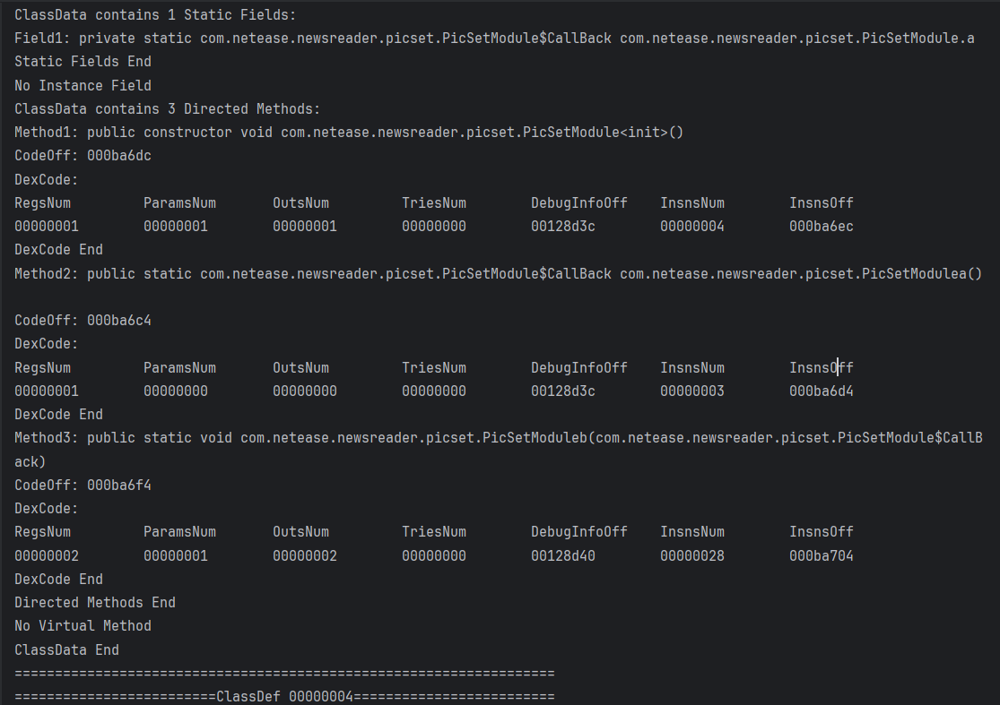

## DexEncodedArray

定义如下

```cpp
struct DexEncodedArray {
    u1  array[1];		//encoded_array格式的数据
};
```

encoded_array格式定义如下：

| 名称   | 格式                | 说明                        |
| :----- | :------------------ | :-------------------------- |
| size   | uleb128             | 表示数组中的元素数量        |
| values | encoded_value[size] | 采用encoded_value编码的数据 |

解析代码如下

```cpp
// 打印StaticValues 实际为DexEncodedArray结构
void DexFile::printClassDefStaticValues(DexEncodedArray& encodedArray) {
    size_t sizeLen=0;
    u4 size=myReadUnsignedLeb128((u1*)&encodedArray,&sizeLen);
    u1* pValues=(u1*)&encodedArray+sizeLen;
    printf("StaticValues contains %d values\n",size);
    size_t offset=0,readSize=0;// offset保存前方已访问的结构大小,readSize为单次读取的大小
    for(int i=0;i<size;i++) {
        printf("%s\n",parseEncodedValue(pValues+offset,readSize).c_str());
        offset+=readSize;
    }
    printf("StaticValues End\n");
}
```

效果如下

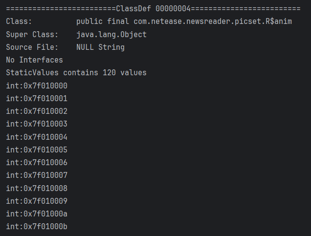


# Android系统可执行文件

## 从JVM到Dalvik再到ART

1. JVM是java语言的虚拟机,运行.class文件

2. Dalvik是google设计的用于Android平台的虚拟机,运行.dex文件

   JVM基于栈,DVM基于寄存器,可以做到更好的提前优化,并且运行速度更快

3. Android 4.4首次提出ART虚拟机,在Android 5.0后弃用Dalvik,默认使用ART,运行oat文件

   DVM应用运行时,字节码需要通过即时编译器JIT转换为机器码运行

   ART则在应用第一次安装时,预先将字节码编译为机器码,该过程称之为预编译(AOT Ahead of time)


## DEX

.java文件 经javac编译后生成 .class 文件 再通过dx/d8生成.dex文件

Dalvik虚拟机运行.dex文件,一个apk包内可能含有多个dex文件

## ODEX

Android5.0前,使用Dalvik虚拟机,ODEX是Dalvik对Dex文件优化后的产物, 通常存放在/data/dalvik-cache目录下

运行程序时直接加载odex文件,避免重复验证和优化

Android 5.0后,使用ART虚拟机, .odex实际上是OAT文件(ART定制的ELF文件)


## OAT

OAT文件是Android4.4中引入的, Android5.0后,系统默认虚拟机为ART

OAT文件即是ART虚拟机对Dex优化后的产物,是Android定制的ELF文件

OAT文件结构随Android版本变化而变化,没有向后兼容性

## VDEX

VDEX文件在Android 8.0后引入, 不是Android系统的可执行文件,

Android 8.0后, dex2oat将class.dex优化生成2个文件: OAT文件(.odex)和VDEX文件(.vdex)

* .odex文件包含了本机代码的OAT文件
* .vdex文件包含了原始的dex文件副本
* vdex文件同oat文件一样,随系统版本变化,且没有向后兼容性


## ART

.art文件是一种ELF可执行文件 借助odex文件优化生成, 记录应用启动的热点函数相关地址,便于寻址加速

art文件结构随android版本变化,无向后兼容性


# Todo

1. 完善encoded_value剩余3个分支解析逻辑
2. 绘制Dex文件结构图加深理解
3. 整理代码架构

# References

[Dalvik 可执行文件格式 ](https://source.android.com/docs/core/dalvik/dex-format) Android官方文档

[Dex文件格式](https://xialuohun.top/posts/android/android%E5%9F%BA%E7%A1%80/dex%E6%96%87%E4%BB%B6%E6%A0%BC%E5%BC%8F)

[dex文件格式解析](https://gal2xy.github.io/2023/11/10/Android%E5%AE%89%E5%85%A8/dex%E6%96%87%E4%BB%B6%E6%A0%BC%E5%BC%8F%E8%A7%A3%E6%9E%90)

[从JVM到Dalivk再到ART（class,dex,odex,vdex,ELF）](https://cloud.tencent.com/developer/article/1634762)

[android的dex，odex，oat，vdex，art文件格式](https://www.cnblogs.com/revercc/p/16677841.html)

[一图全览DEX文件格式](https://www.52pojie.cn/thread-1992796-1-1.html)